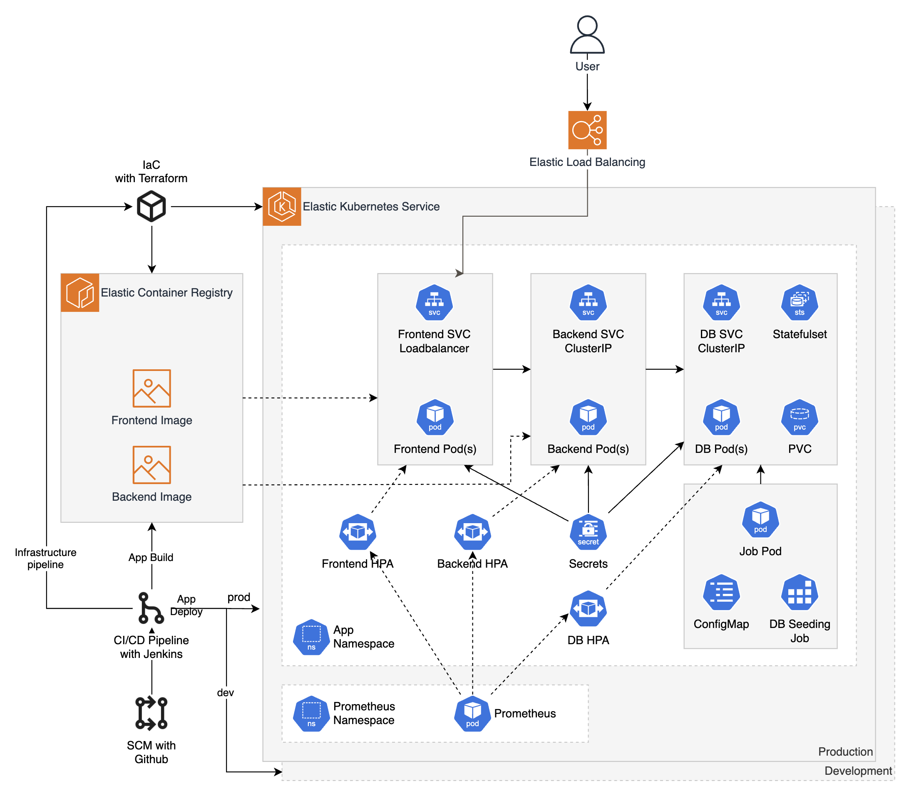
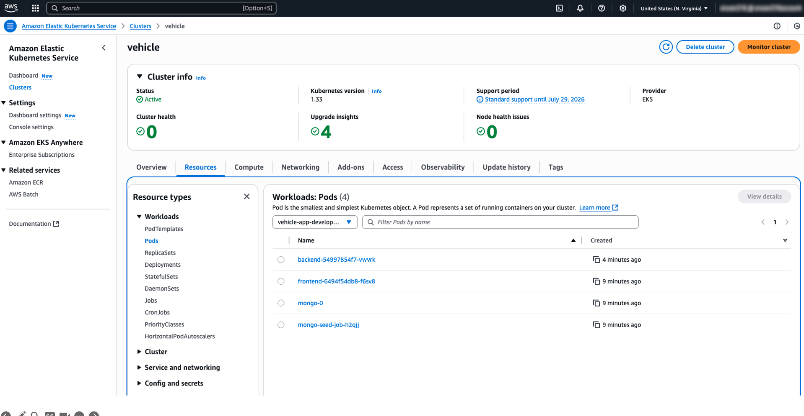
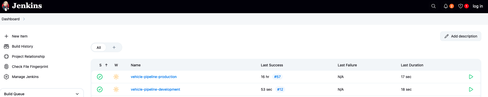
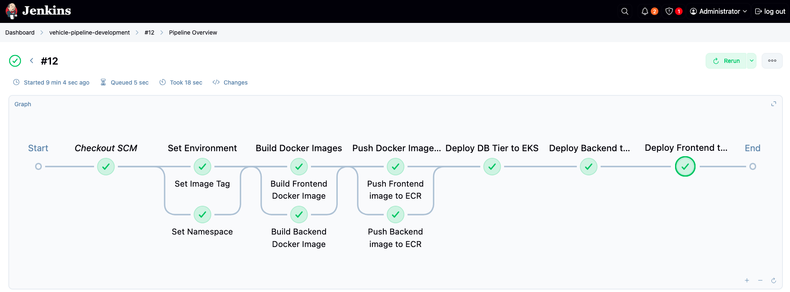

# Vehicle App

This is a simple vehicle app that allows Vehicle inspectors to check whether a vehicle needs to be seized or not.

## Application Demo

Following is a demo of the application:


## Application Architecture

Following is the architecture of the application:



## Building and deploying the App manually

The steps below will guide you through building and deploying the Vehicle App manually using Docker and Kubernetes.

### Infrastructure Setup

Deploy the EKS cluster using `eksctl`. This is going to take a while, so you can continue with the next steps.

```bash
eksctl create cluster -f cluster.yaml
```

Create two ECR repositories in your AWS account:

```bash
aws ecr create-repository --repository-name vehicle-backend-bloom
aws ecr create-repository --repository-name vehicle-frontend
BACKEND_IMAGE=$(aws ecr describe-repositories --repository-names vehicle-backend-bloom --query "repositories[0].repositoryUri" --output text)
FRONTEND_IMAGE=$(aws ecr describe-repositories --repository-names vehicle-frontend --query "repositories[0].repositoryUri" --output text)
```

### Application Build

Build the backend image and push to ECR,

```bash
cd vehicle-backend-bloom
docker build --platform linux/amd64 -t ${BACKEND_IMAGE}:latest .
docker push ${BACKEND_IMAGE}:latest
```

Build the frontend image and push to ECR,

```bash
cd ../vehicle-frontend
docker build --platform linux/amd64 -t ${FRONTEND_IMAGE}:latest . -f Dockerfile.prod
docker push ${FRONTEND_IMAGE}:latest
```

### Running the application locally with Docker Compose

To run the application locally using Docker Compose, ensure you have Docker installed and then execute the following command:

```bash
docker compose up -d
```

### Enable Kubernetes Metrics Server

Ensure that the Kubernetes Metrics Server is installed in your EKS cluster. This is required for Horizontal Pod Autoscaling.

```bash
# Enable gp2 as the default storage class in AWS EKS
kubectl patch storageclass gp2 -p '{"metadata": {"annotations":{"storageclass.kubernetes.io/is-default-class":"true"}}}'
kubectl create namespace monitoring
helm repo add prometheus-community https://prometheus-community.github.io/helm-charts
helm repo update
helm install prometheus prometheus-community/prometheus --namespace monitoring
helm install prometheus-adapter prometheus-community/prometheus-adapter --namespace monitoring
helm upgrade --install prometheus-adapter prometheus-community/prometheus-adapter \
  --namespace monitoring -f ./eks/HPA/hpa-values.yaml
```

### Deploy the Application

Make sure the EKS cluster is up and running, then deploy the application using Kubernetes manifests.

Create a namespace for the application:

```bash
NAMESPACE=vehicle-app
kubectl create namespace $NAMESPACE
kubectl config set-context --current --namespace=$NAMESPACE
```

Deploy the application:

```bash
kubectl apply -f ./eks/
kubectl apply -f ./eks/HPA/hpa.yaml
```

You can check the status of the cluster and pods using:

```bash
kubectl get pods
```
A sample view of the pods in the EKS GUI is shown below:



Check the loadbalancer service to get the external IP:

### Accessing the Application

```bash
kubectl get -f ./eks/frontend-service.yaml 
```

Access the frontend at the external IP address provided by the LoadBalancer service.

### Cleanup

To clean up the resources created during this setup, you can delete the namespace and the EKS cluster:

```bash
kubectl delete namespace $NAMESPACE
kubectl delete namespace monitoring
eksctl delete cluster -f cluster.yaml
```

## Deploy with Terraform and Jenkins

To deploy the Vehicle App using Terraform and Jenkins, follow these steps:

1. **Set up Jenkins**: Ensure you have a Jenkins server running and configured with the necessary plugins for Terraform and Kubernetes.
2. **Create a Jenkins Pipeline**: Create a Jenkins pipeline that will:
   - Clone the repository containing the Vehicle App code.
   - Use Terraform to provision the EKS cluster and deploy the application.
   - Build and push Docker images to ECR.
   - Apply Kubernetes manifests to deploy the application.
   - **Configure Jenkins Credentials**: Ensure that Jenkins has the necessary AWS credentials and permissions to interact with EKS and ECR
   - **Configure Jenkins Environment Variables**: Set environment variables for the ECR repository URIs and other necessary configurations.
   - **Trigger the Pipeline**: Run the Jenkins pipeline to deploy the Vehicle App.

Following is a sample Jenkins pipeline view,



Following is a sample execution of the Jenkins pipeline,



### Notes

1. A sample Jenkinsfile is provided in the repository to help you get started with the pipeline configuration.
2. A sample Terraform configuration is also provided to set up the EKS cluster.
